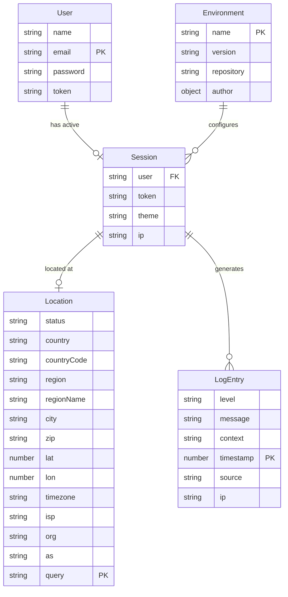

# Domain Model for Archetype Angular SPA

## Overview

**Archetype Angular SPA** operates in the web application development domain, managing user authentication, session state, location data, application configuration, and system logging for modern Angular single-page applications.

## Main Entities

### E1 User

**Description:** Represents a user of the system with authentication credentials and profile information

**Attributes:**
- name: string - The display name of the user
- email: string - Unique email address used for authentication (acts as identifier)
- password: string - Encrypted password for authentication
- token: string - JWT or similar authentication token for session management

### E2 Session

**Description:** Represents the current user session and global application state

**Attributes:**
- user: string | undefined - Currently authenticated user identifier
- token: string | undefined - Active authentication token
- theme: string - Current UI theme preference (light/dark)
- ip: string | undefined - User's IP address for location services

### E3 Location

**Description:** Geographic location information obtained from IP geolocation services

**Attributes:**
- status: string - API response status
- country: string - Country name
- countryCode: string - ISO country code
- region: string - Region/state code
- regionName: string - Region/state name
- city: string - City name
- zip: string - Postal code
- lat: number - Latitude coordinate
- lon: number - Longitude coordinate
- timezone: string - Timezone identifier
- isp: string - Internet Service Provider
- org: string - Organization name
- as: string - Autonomous System information
- query: string - Queried IP address

### E4 LogEntry

**Description:** System log entry for debugging and monitoring purposes

**Attributes:**
- level: string - Log level (error, warn, info, debug)
- message: string - Log message content
- context: string - Contextual information about the log
- timestamp: number - Unix timestamp of the log entry
- source: string - Source component or service that generated the log
- ip: string - IP address associated with the log entry

### E5 Environment

**Description:** Application configuration and metadata

**Attributes:**
- name: string - Application name
- version: string - Application version number
- repository: string - Git repository URL
- author: object - Author information containing name, email, and URL

## Entity Relationships

### R1 User ↔ Session

**Relationship Type:** One-to-One
**Description:** A user can have at most one active session, and a session belongs to one user
**Business Rule:** User authentication creates or updates the session state. Logout clears the session.

### R2 Session ↔ Location

**Relationship Type:** One-to-One
**Description:** Each session can have one associated location based on the user's IP address
**Business Rule:** Location data is fetched when a session is established and used for personalization.

### R3 Session ↔ LogEntry

**Relationship Type:** One-to-Many
**Description:** A session can generate multiple log entries during its lifetime
**Business Rule:** All user actions and system events within a session are logged for monitoring and debugging.

### R4 Environment ↔ Session

**Relationship Type:** One-to-Many
**Description:** The environment configuration applies to all sessions in the application
**Business Rule:** Environment settings are shared across all user sessions and define application behavior.

## Business Rules and Validations

### Data Validation Rules

1. **User Authentication**
   - Email must be a valid email format and unique in the system
   - Password must contain at least one digit and one letter
   - Password confirmation must match the original password during registration

2. **Session Management**
   - Only one active session per user at a time
   - Session tokens must be valid and not expired
   - Theme preference must be either "light" or "dark"

3. **Location Data**
   - Location data is optional and depends on external API availability
   - Coordinates must be valid latitude (-90 to 90) and longitude (-180 to 180) values

### Business Operation Rules

1. **Authentication Flow**
   - Users must register before they can log in
   - Failed login attempts should be logged for security monitoring
   - Password reset requires email verification

2. **Session State Management**
   - Theme preference persists across browser sessions
   - Location data is refreshed on each new session
   - Session state is cleared on logout or token expiration

3. **Logging and Monitoring**
   - All authentication events must be logged
   - Error logs must include sufficient context for debugging
   - Log entries are associated with the user's IP address for security tracking

## Entity-Relationship Diagram

## Additional Information

This domain model reflects the core business concepts for a modern Angular SPA archetype. The design emphasizes:

- **Security**: Proper authentication and session management
- **User Experience**: Theme preferences and location-based personalization
- **Monitoring**: Comprehensive logging for debugging and security
- **Configuration**: Environment-based settings for different deployment contexts

The domain model supports both human developers and AI tools in understanding the data structures and business rules necessary for building Angular applications from this archetype.

- [Git repository](https://github.com/AIcodeAcademy/ArchetypeAngularSPA)
- [PRD Document](./PRD.md)
- [SYSTEMS Architecture](./SYSTEMS.md)
- [BACKLOG of features](./BACKLOG.md)

> End of DOMAIN for Archetype Angular SPA, last updated on July 30, 2025.
