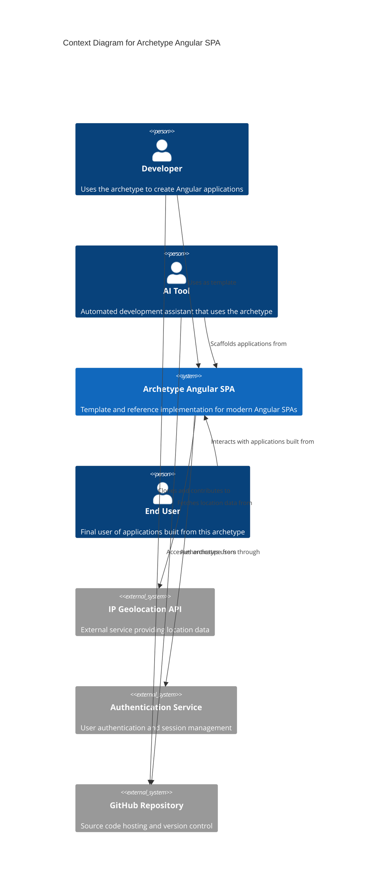

# Project Requirements Document for Archetype Angular SPA

## Overview

**Archetype Angular SPA** aims to provide a foundational template and reference implementation for AI-powered tools to create modern Single Page Applications using Angular with best practices and contemporary development patterns.

This project serves as a starting point for developers and AI assistants to quickly scaffold Angular applications that follow modern conventions including standalone components, signals-based state management, and clean architecture patterns.

### Goals

- **G1**: Provide a modern Angular SPA template that follows current best practices and patterns
- **G2**: Enable AI tools and developers to quickly bootstrap Angular applications with authentication, theming, and common features
- **G3**: Demonstrate clean architecture patterns with clear separation between containers and presentational components
- **G4**: Showcase modern Angular features including standalone components, signals, and resource-based data fetching
- **G5**: Establish consistent naming conventions and project structure standards for Angular SPAs

## Requirements

### R1 Modern Angular Architecture

The system must implement a modern Angular application using standalone components, signals for state management instead of traditional RxJS observables, and contemporary template syntax. The application must use Angular 20+ and demonstrate current best practices.

### R2 Authentication and Authorization System

The system must provide a complete authentication flow including user registration, login, password reset functionality, and user profile management. Authentication state must be managed using signals and integrate with routing for protected routes.

### R3 Theme Management

The application must include a theme toggle system that allows users to switch between light and dark themes. Theme state must persist across browser sessions and be managed through a centralized theming service.

### R4 Home Dashboard with External API Integration

The system must include a home page that displays user location information by integrating with an external IP geolocation API. This demonstrates external API integration patterns and resource-based data fetching using Angular's modern resource API.

### R5 Clean Architecture and Project Structure

The application must follow a clean architecture pattern with clear separation between:
- Core features (authentication, interceptors, shared UI components)
- Route-based containers (pages)
- Shared utilities and services
- Presentational components

### R6 Development Tooling and Code Quality

The project must include modern development tooling including TypeScript configuration, Prettier for code formatting, and Angular CLI integration. The codebase must demonstrate consistent coding standards and best practices.

## Technical Constraints

- **Framework**: Angular 20+ with standalone components architecture
- **State Management**: Angular Signals instead of RxJS for local state management
- **Styling**: CSS with theme support, no external CSS frameworks required
- **Build Tool**: Angular CLI with default build configuration
- **Browser Support**: Modern browsers with ES2022+ support
- **Development Environment**: Node.js with npm package manager
- **External Dependencies**: Minimal external dependencies, leveraging Angular's built-in capabilities

### Context Diagram

## Additional Information

This archetype is part of the AIDDbot ecosystem, designed to work seamlessly with AI development assistants. The project demonstrates modern Angular development patterns that can be understood and replicated by both human developers and AI tools.

Key architectural decisions include:
- **Naming Convention**: `*.page` for routed containers, `*.component` for presentational components
- **State Management**: Signals-based stores for reactive state management
- **Routing**: File-based routing structure with lazy-loaded routes
- **Forms**: Reactive forms with custom validation patterns
- **Interceptors**: HTTP interceptors for authentication, caching, and logging

- [Git repository](https://github.com/AIcodeAcademy/ArchetypeAngularSPA)
- [DOMAIN Models](./DOMAIN.md)
- [SYSTEMS Architecture](./SYSTEMS.md)
- [BACKLOG of features](./BACKLOG.md)

> End of PRD for Archetype Angular SPA, last updated on July 30, 2025.
