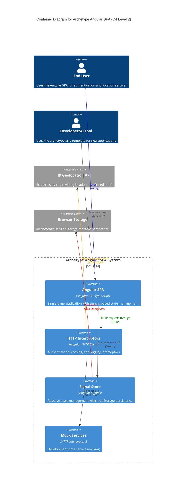

# Systems Architecture for Archetype Angular SPA

## Overview

**Archetype Angular SPA** follows a modern client-side architecture, designed for high performance and developer experience with signal-based state management and zoneless change detection.

## System Components

### S1 Angular Frontend Application

**Purpose:** Single-page application providing user interface and client-side logic

**Technology Stack:**
- **Language**: TypeScript 5.8+
- **Framework**: Angular 20+ with standalone components
- **Key Libraries**: RxJS, Zone.js (optional)

**Responsibilities:**
- User interface rendering and interaction
- Client-side routing and navigation
- State management using Angular Signals
- HTTP communication with external APIs
- Authentication and session management
- Theme management and personalization

### S2 HTTP Interceptor Layer

**Purpose:** Cross-cutting concerns for HTTP communications

**Technology Stack:**
- **Language**: TypeScript
- **Framework**: Angular HTTP Client
- **Key Libraries**: RxJS operators

**Responsibilities:**
- Authentication token injection
- HTTP response caching
- Request/response logging
- Mock API responses for development
- Error handling and retry logic

### S3 Signal-Based State Management

**Purpose:** Reactive state management without traditional observables

**Technology Stack:**
- **Language**: TypeScript
- **Framework**: Angular Signals
- **Key Libraries**: Browser localStorage API

**Responsibilities:**
- Global application state management
- User session persistence
- Theme preference storage
- Reactive computed values
- State synchronization with local storage

### S4 External API Integration Layer

**Purpose:** Integration with third-party services

**Technology Stack:**
- **Language**: TypeScript
- **Framework**: Angular Resource API
- **Key Libraries**: Angular HTTP Client

**Responsibilities:**
- IP geolocation data fetching
- User authentication (mocked)
- Error handling for external services
- Data transformation and mapping

## Data Layer

### Database Design

**Database Type:** Browser Storage (Local Storage/Session Storage)
**Technology:** Web Storage API

**Data Access Patterns:**
- **Cache Service Pattern**: Centralized storage access through cache service
- **Signal Store Pattern**: Reactive state management with automatic persistence
- **Resource Pattern**: Async data fetching with loading/error states

**Key Design Decisions:**
- No traditional database - client-side storage only
- State persistence using browser localStorage
- Ephemeral session data for sensitive information
- Mock data for development and demonstration

## Integration Patterns

### I1 IP Geolocation API Integration

**Type:** REST API
**Purpose:** Retrieve user location data based on IP address
**Protocol:** HTTPS
**Data Format:** JSON

**Implementation:**
- Async resource-based data fetching
- Automatic loading and error state management
- Data caching for performance optimization

### I2 Mock Authentication Service

**Type:** HTTP Interceptor Mock
**Purpose:** Simulate user authentication and registration
**Protocol:** HTTP (intercepted)
**Data Format:** JSON

**Implementation:**
- Interceptor-based request/response mocking
- JWT-like token generation for sessions
- User credential validation simulation

### I3 Logging Integration

**Type:** Mock HTTP Service
**Purpose:** System event logging and monitoring
**Protocol:** HTTP (intercepted)
**Data Format:** JSON

**Implementation:**
- Structured logging with levels and context
- Automatic IP address association
- Development-time log capture and display

## Security Architecture

### Authentication & Authorization

**Authentication Method:** JWT-like token-based authentication (mocked)
**Session Management:** Signal-based state with localStorage persistence
**Authorization Pattern:** Route-based guards with token validation

**Security Features:**
- HTTP interceptor for automatic token injection
- Secure password validation with custom validators
- Session timeout and token expiration handling
- XSS protection through Angular's built-in sanitization

### Data Protection

**Client-Side Security:**
- Sensitive data stored in memory signals only
- No persistent storage of passwords or sensitive tokens
- HTTPS enforcement for all external API calls
- Content Security Policy compatibility

## System Architecture Diagram

## Technical Architecture Patterns

### Modern Angular Patterns

1. **Standalone Components**: All components are standalone, reducing bundle size and improving tree-shaking
2. **Signal-Based State Management**: Replacing RxJS observables with Angular Signals for better performance
3. **Zoneless Change Detection**: Optional zone.js for improved performance
4. **Resource API**: Modern async data fetching with built-in loading states

### Code Organization Patterns

1. **Feature-Based Structure**: Organized by business features (user, home) rather than technical layers
2. **Container/Presentational Pattern**: Clear separation between smart containers (*.page) and dumb components
3. **Shared Services Pattern**: Common utilities and services in shared folder
4. **Environment Configuration**: Separate configurations for development and production

### Development Patterns

1. **Mock-Driven Development**: HTTP interceptors provide realistic mock data during development
2. **Type-Safe Development**: Comprehensive TypeScript types for all data structures
3. **Reactive Forms**: Template-driven forms with custom validators
4. **Lazy Loading**: Route-based code splitting for optimal performance

## Additional Information

This architecture serves as a reference implementation demonstrating modern Angular development practices that can be understood and replicated by both human developers and AI development assistants.

Key architectural principles:
- **Simplicity**: Minimal external dependencies, leveraging Angular's built-in capabilities
- **Performance**: Signals-based reactivity and zoneless change detection
- **Developer Experience**: Clear patterns, consistent naming, and comprehensive typing
- **AI-Friendly**: Predictable structure and patterns that AI tools can easily understand and replicate

- [Git repository](https://github.com/AIcodeAcademy/ArchetypeAngularSPA)
- [PRD Document](./PRD.md)
- [DOMAIN Models](./DOMAIN.md)
- [BACKLOG of features](./BACKLOG.md)

> End of SYSTEMS for Archetype Angular SPA, last updated on July 30, 2025.
